# ⚡ JavaScript Mastery Roadmap
### *From Zero to Hero - The Complete Developer Guide*

<div align="center">


**🎯 Master JavaScript with 200+ essential concepts and build production-ready applications!**

</div>

---

## 🚀 Quick Start Guide

| Prerequisites | Essential Tools | Learning Track | Timeline |
|---------------|-----------------|----------------|----------|
| 📝 Basic HTML/CSS | 🆚 VS Code Editor | 🎯 Structured Path | 4-8 months |
| 🧠 Problem-solving mindset | 🌐 Modern Browser | 🛠️ Project-based | 2-3 hours/day |
| 💻 Computer setup | 📦 Node.js & npm | 🤝 Community support | Practice daily |

---

## 📍 Learning Journey Overview

```
🌱 Fundamentals → 🎨 DOM Magic → 🌐 Async Mastery → ⚛️ Frameworks → 🏆 Professional → 🚀 Expert
   (3-4 weeks)     (4-5 weeks)    (5-6 weeks)      (8-10 weeks)   (6-8 weeks)    (Ongoing)
```

---

## 🌱 Phase 1: JavaScript Fundamentals
**⏱️ Duration: 3-4 weeks | 🎯 Goal: Master Core Syntax**

<details>
<summary><strong>🔥 Essential Keywords & Concepts (Click to expand)</strong></summary>

### 📝 Variables & Data Types
**Keywords:** `let`, `const`, `var`, `typeof`, `instanceof`
- Variable declarations and hoisting
- Primitive types: `string`, `number`, `boolean`, `null`, `undefined`, `symbol`, `bigint`
- Reference types: `object`, `array`, `function`
- Type coercion and conversion (`String()`, `Number()`, `Boolean()`)
- Template literals and string methods

### 🔄 Operators & Control Flow
**Keywords:** `if`, `else`, `switch`, `case`, `for`, `while`, `do-while`, `break`, `continue`
- Arithmetic: `+`, `-`, `*`, `/`, `%`, `**`
- Comparison: `==`, `===`, `!=`, `!==`, `>`, `<`, `>=`, `<=`
- Logical: `&&`, `||`, `!`, nullish coalescing `??`
- Ternary operator `? :`
- Loop variations: `for...in`, `for...of`

### ⚡ Functions Deep Dive
**Keywords:** `function`, `return`, `arguments`, `this`, `call`, `apply`, `bind`
- Function declarations vs expressions
- Arrow functions and lexical `this`
- Parameters: default, rest `...args`, destructuring
- IIFE (Immediately Invoked Function Expression)
- Function scope and closure basics

### 📊 Data Structures
**Keywords:** `Array`, `Object`, `JSON`, `Map`, `Set`
- Array methods: `push()`, `pop()`, `shift()`, `unshift()`, `slice()`, `splice()`
- Object creation patterns and property access
- JSON parsing: `JSON.parse()`, `JSON.stringify()`
- Introduction to `Map` and `Set`

</details>

**🎯 Build Projects:** 
- 🧮 Advanced Calculator with Memory Functions
- 🎲 Interactive Dice Game with Score Tracking
- 📊 Grade Calculator with Statistics

---

## 🎨 Phase 2: DOM Manipulation & Advanced Functions
**⏱️ Duration: 4-5 weeks | 🎯 Goal: Interactive Web Applications**

<details>
<summary><strong>🔥 DOM & Event Mastery (Click to expand)</strong></summary>

### 🌐 DOM Manipulation
**Keywords:** `document`, `getElementById`, `querySelector`, `createElement`, `appendChild`
- Element selection: `querySelector()`, `querySelectorAll()`, `getElementById()`
- Content modification: `innerHTML`, `textContent`, `innerText`
- Attribute manipulation: `getAttribute()`, `setAttribute()`, `classList`
- Style manipulation: `style` property, CSS classes
- Element creation and removal: `createElement()`, `appendChild()`, `removeChild()`

### 🎯 Event Handling
**Keywords:** `addEventListener`, `event`, `preventDefault`, `stopPropagation`, `target`
- Event types: `click`, `submit`, `keydown`, `keyup`, `change`, `input`, `load`
- Event object properties: `target`, `currentTarget`, `type`
- Event delegation and bubbling
- Custom events: `CustomEvent`, `dispatchEvent`

### 🚀 Advanced Functions
**Keywords:** `callback`, `closure`, `higher-order`, `pure function`, `side effects`
- Higher-order functions and callbacks
- Closures and lexical scoping
- Array iteration methods: `map()`, `filter()`, `reduce()`, `forEach()`, `find()`, `some()`, `every()`
- Function composition and currying
- Recursion and tail call optimization

### 💾 Browser Storage
**Keywords:** `localStorage`, `sessionStorage`, `cookies`, `IndexedDB`
- Web Storage API: `localStorage` vs `sessionStorage`
- Cookie management and security
- Data serialization and parsing
- Storage events and quota management

</details>

**🎯 Build Projects:**
- 📝 Advanced To-Do App with Categories & Filters
- 🎵 Music Player with Playlist Management
- 🛒 Shopping Cart with Persistent Storage

---

## 🌐 Phase 3: Asynchronous JavaScript & APIs
**⏱️ Duration: 5-6 weeks | 🎯 Goal: Master Async Programming**

<details>
<summary><strong>🔥 Async Programming Mastery (Click to expand)</strong></summary>

### ⏰ Timing & Async Basics
**Keywords:** `setTimeout`, `setInterval`, `clearTimeout`, `requestAnimationFrame`
- JavaScript event loop and call stack
- Microtasks vs macrotasks
- Animation frame scheduling
- Debouncing and throttling techniques

### 🤝 Promises & Async/Await
**Keywords:** `Promise`, `resolve`, `reject`, `then`, `catch`, `finally`, `async`, `await`
- Promise creation and chaining
- Promise states: pending, fulfilled, rejected
- `Promise.all()`, `Promise.race()`, `Promise.allSettled()`
- Error handling with `try/catch` in async functions
- Converting callbacks to promises

### 🌍 HTTP & APIs
**Keywords:** `fetch`, `XMLHttpRequest`, `JSON`, `REST`, `CRUD`, `HTTP status codes`
- Fetch API and request configuration
- HTTP methods: GET, POST, PUT, DELETE, PATCH
- Request headers and authentication
- Response handling and error codes
- CORS (Cross-Origin Resource Sharing)
- GraphQL basics

### 🔧 Error Handling & Debugging
**Keywords:** `try`, `catch`, `finally`, `throw`, `Error`, `console`, `debugger`
- Error types: `SyntaxError`, `TypeError`, `ReferenceError`
- Custom error creation and handling
- Browser dev tools mastery
- Performance profiling and memory leaks
- Network debugging techniques

</details>

**🎯 Build Projects:**
- ☁️ Weather Dashboard with Geolocation
- 🎬 Movie Database with Search & Filters
- 📰 News Aggregator with Real-time Updates

---

## ⚛️ Phase 4: Modern JavaScript & Frameworks
**⏱️ Duration: 8-10 weeks | 🎯 Goal: Framework Proficiency**

<details>
<summary><strong>🔥 Modern JS & Build Tools (Click to expand)</strong></summary>

### 🆕 ES6+ Features
**Keywords:** `import`, `export`, `class`, `extends`, `super`, `static`, `private`
- Module system: `import/export`, default exports
- Classes and inheritance: constructor, methods, getters/setters
- Advanced destructuring and spread operator
- Template literals and tagged templates
- Symbols and iterators/generators
- Proxy and Reflect API

### 🛠️ Development Tools
**Keywords:** `npm`, `webpack`, `babel`, `eslint`, `prettier`, `git`
- Package management with npm/yarn
- Module bundlers: Webpack, Vite, Parcel
- Code transpilation with Babel
- Linting and formatting tools
- Version control with Git
- Environment variables and configuration

### 🧪 Testing Fundamentals
**Keywords:** `jest`, `test`, `expect`, `mock`, `unit testing`, `integration testing`
- Unit testing with Jest
- Test-driven development (TDD)
- Mocking and test doubles
- Code coverage and quality metrics
- End-to-end testing basics

</details>

<details>
<summary><strong>🎨 Choose Your Framework Path (Click to expand)</strong></summary>

### ⚛️ React Ecosystem
**Keywords:** `component`, `JSX`, `props`, `state`, `hooks`, `useEffect`, `useState`
- Component lifecycle and rendering
- Props vs state management
- React Hooks: `useState`, `useEffect`, `useContext`, `useReducer`
- Event handling in React
- React Router for navigation
- State management: Context API, Redux Toolkit
- Performance optimization: `memo`, `useMemo`, `useCallback`

### 💚 Vue.js Ecosystem
**Keywords:** `template`, `directive`, `reactive`, `computed`, `watcher`, `composition`
- Vue template syntax and directives
- Reactivity system and data binding
- Component communication: props, events, slots
- Vue Router and navigation guards
- State management with Pinia/Vuex
- Composition API vs Options API

### 🟢 Node.js Backend
**Keywords:** `express`, `middleware`, `route`, `request`, `response`, `database`
- Node.js runtime and modules
- Express.js framework and middleware
- RESTful API design and implementation
- Database integration: MongoDB, PostgreSQL
- Authentication: JWT, sessions, OAuth
- Security best practices and validation

</details>

**🎯 Build Projects:**
- 💬 Real-time Chat Application
- 🏪 E-commerce Platform with Payment
- 📱 Social Media Dashboard

---

## 🏆 Phase 5: Professional Development
**⏱️ Duration: 6-8 weeks | 🎯 Goal: Industry-Ready Skills**

<details>
<summary><strong>🔥 Production-Ready Skills (Click to expand)</strong></summary>

### 📈 Performance Optimization
**Keywords:** `lazy loading`, `code splitting`, `caching`, `minification`, `compression`
- Bundle optimization and tree shaking
- Image optimization and lazy loading
- Caching strategies: browser, CDN, service workers
- Core Web Vitals and performance metrics
- Memory management and garbage collection

### 🔐 Security & Best Practices
**Keywords:** `XSS`, `CSRF`, `HTTPS`, `authentication`, `authorization`, `validation`
- Input validation and sanitization
- Cross-site scripting (XSS) prevention
- CSRF protection and secure headers
- Authentication patterns and JWT
- OWASP security guidelines

### 🚀 Advanced Patterns
**Keywords:** `design patterns`, `singleton`, `factory`, `observer`, `MVC`, `SOLID`
- Design patterns: Module, Factory, Observer, Singleton
- Architectural patterns: MVC, MVP, MVVM
- SOLID principles in JavaScript
- Dependency injection and inversion of control
- Micro-frontends and modular architecture

### 🌐 Progressive Web Apps
**Keywords:** `service worker`, `manifest`, `offline`, `push notifications`, `installable`
- Service workers and caching strategies
- Web app manifest and installation
- Offline functionality and background sync
- Push notifications and engagement
- Performance and accessibility auditing

</details>

**🎯 Build Projects:**
- 🚀 Progressive Web App with Offline Support
- 🎮 Browser-based Game with Multiplayer
- 📊 Data Visualization Dashboard

---

## 🚀 Phase 6: Expert Level & Specialization
**⏱️ Duration: Ongoing | 🎯 Goal: Technical Leadership**

<details>
<summary><strong>🔥 Cutting-Edge Technologies (Click to expand)</strong></summary>

### 💎 Advanced JavaScript
**Keywords:** `TypeScript`, `decorators`, `metaclasses`, `bytecode`, `JIT compilation`
- TypeScript integration and advanced types
- Functional programming paradigms
- Advanced async patterns: observables, streams
- JavaScript engine internals
- Custom transpilers and AST manipulation

### 🌟 Emerging Technologies
**Keywords:** `WebAssembly`, `WebGL`, `WebRTC`, `AI/ML`, `blockchain`, `edge computing`
- WebAssembly integration
- 3D graphics with Three.js/WebGL
- Real-time communication with WebRTC
- AI/ML in JavaScript: TensorFlow.js
- Blockchain and Web3 development

### 👥 Leadership & Architecture
**Keywords:** `mentoring`, `code review`, `system design`, `scalability`, `documentation`
- Technical mentoring and code reviews
- System architecture and scalability
- Open source contributions and maintenance
- Technical writing and documentation
- Conference speaking and knowledge sharing

</details>

**🎯 Build Projects:**
- 🏗️ Open Source Library/Framework
- 🌐 SaaS Platform with Microservices
- 🤖 AI-Powered Web Application

---

## 🎯 Essential Keywords Checklist

### 🔤 Language Fundamentals (Must Know)
```
Variables: let, const, var, hoisting, scope
Types: string, number, boolean, null, undefined, symbol, bigint
Operators: +, -, *, /, %, ==, ===, &&, ||, ??, ?.
Control: if, else, switch, for, while, break, continue
Functions: function, arrow, return, arguments, this, bind, call, apply
```

### 🌐 Web APIs (Essential)
```
DOM: document, querySelector, addEventListener, event, element
Storage: localStorage, sessionStorage, cookies, IndexedDB
Network: fetch, XMLHttpRequest, Promise, async, await
Browser: window, navigator, location, history, console
```

### ⚡ Modern JavaScript (Advanced)
```
Modules: import, export, default, dynamic import
Classes: class, extends, super, static, private, constructor
Async: Promise, resolve, reject, then, catch, finally
Arrays: map, filter, reduce, forEach, find, some, every
Objects: destructuring, spread, rest, Object.assign, Object.keys
```

---

## 🛠️ Essential Learning Resources

### 📖 Documentation & References
- **[MDN Web Docs](https://developer.mozilla.org/en-US/docs/Web/JavaScript)** - Official JavaScript reference
- **[JavaScript.info](https://javascript.info)** - Modern JavaScript tutorial
- **[Can I Use](https://caniuse.com)** - Browser compatibility tables
- **[TC39 Proposals](https://github.com/tc39/proposals)** - Future JavaScript features

### 🎯 Interactive Learning
- **[freeCodeCamp](https://www.freecodecamp.org)** - Comprehensive coding curriculum
- **[Codecademy JavaScript](https://www.codecademy.com/learn/introduction-to-javascript)** - Interactive courses
- **[JavaScript30](https://javascript30.com)** - 30 vanilla JS projects
- **[Exercism JavaScript Track](https://exercism.org/tracks/javascript)** - Coding exercises with mentoring

### 🏆 Practice Platforms
- **[LeetCode](https://leetcode.com)** - Algorithm and data structure problems
- **[Codewars](https://www.codewars.com)** - Coding challenges and katas
- **[HackerRank](https://www.hackerrank.com/domains/javascript)** - JavaScript-specific challenges
- **[Frontend Mentor](https://www.frontendmentor.io)** - Real-world project challenges

### 🎥 Video Content
- **[JavaScript Mastery](https://www.youtube.com/c/JavaScriptMastery)** - Modern JS and frameworks
- **[Traversy Media](https://www.youtube.com/c/TraversyMedia)** - Web development tutorials
- **[Fun Fun Function](https://www.youtube.com/c/mpjmevideos)** - Functional programming in JS
- **[The Net Ninja](https://www.youtube.com/c/TheNetNinja)** - JavaScript and framework tutorials

---

## 🎯 Project Portfolio by Phase

| Phase | Beginner Projects | Intermediate Projects | Advanced Projects | Expert Projects |
|-------|------------------|---------------------|------------------|-----------------|
| **🌱 Fundamentals** | Calculator, Quiz App | Form Validator, Memory Game | Data Structures Visualizer | Custom Testing Framework |
| **🎨 DOM & Events** | To-Do List, Color Picker | Music Player, Drawing App | Image Editor, Kanban Board | Browser Extension |
| **🌐 Async & APIs** | Weather App, Joke Generator | Movie Database, News Reader | Real-time Chat, Stock Tracker | API Gateway, WebSocket Server |
| **⚛️ Frameworks** | Component Library | E-commerce Site | Social Platform | Micro-frontend Architecture |
| **🏆 Professional** | PWA, Performance Audit | Testing Suite, CI/CD Pipeline | Monitoring Dashboard | Developer Tools |
| **🚀 Expert** | Open Source Library | SaaS Platform | AI/ML Application | Technical Framework |

---

## 💡 Pro Tips for Accelerated Learning

### 🎯 **The 3-2-1 Learning Method**
- **3 concepts** to learn each day
- **2 practical examples** for each concept  
- **1 project** to apply the knowledge

### 🔄 **Active Learning Strategies**
- **Feynman Technique:** Explain concepts in simple terms
- **Pomodoro Sessions:** 25-minute focused study blocks
- **Spaced Repetition:** Review concepts at increasing intervals
- **Teaching Others:** Share knowledge through blogs/videos

### 🛠️ **Build-First Approach** 
- Start with a project idea, learn concepts as needed
- Focus on solving real problems, not just syntax
- Refactor and improve projects as you learn more
- Document your learning journey and decisions

### 🤝 **Community Engagement**
- **Twitter:** Follow JavaScript developers and engage with #JavaScript
- **Discord/Slack:** Join JavaScript communities for real-time help
- **GitHub:** Contribute to open source projects and showcase work
- **Dev.to/Reddit:** Share learnings and get feedback from peers

---

## 📊 JavaScript Mastery Roadmap Diagram

```mermaid
graph TD
    A[🌱 JavaScript Fundamentals<br/>Variables, Functions, Control Flow] --> B[🎨 DOM & Advanced Functions<br/>Events, Storage, Array Methods]
    B --> C[🌐 Async Programming<br/>Promises, APIs, Error Handling]
    C --> D{🚀 Choose Specialization}
    
    D --> E[⚛️ React Ecosystem<br/>Components, Hooks, State Management]
    D --> F[💚 Vue.js Ecosystem<br/>Templates, Reactivity, Composition API]
    D --> G[🟢 Node.js Backend<br/>Express, APIs, Databases]
    
    E --> H[🏆 Professional Skills<br/>Testing, Performance, Security]
    F --> H
    G --> H
    
    H --> I[🚀 Expert Specialization<br/>Architecture, Leadership, Innovation]
    
    I --> J{🌟 Career Paths}
    J --> K[👨‍💻 Frontend Architect]
    J --> L[🔧 Full-Stack Engineer]  
    J --> M[🏗️ Technical Lead]
    J --> N[📚 Developer Advocate]
    
    style A fill:#1e3a8a,color:#ffffff,stroke:#ffffff,stroke-width:3px
    style B fill:#7c2d12,color:#ffffff,stroke:#ffffff,stroke-width:3px
    style C fill:#14532d,color:#ffffff,stroke:#ffffff,stroke-width:3px
    style D fill:#ea580c,color:#ffffff,stroke:#ffffff,stroke-width:4px
    style E fill:#1e40af,color:#ffffff,stroke:#ffffff,stroke-width:3px
    style F fill:#16a34a,color:#ffffff,stroke:#ffffff,stroke-width:3px
    style G fill:#65a30d,color:#ffffff,stroke:#ffffff,stroke-width:3px
    style H fill:#be185d,color:#ffffff,stroke:#ffffff,stroke-width:3px
    style I fill:#d97706,color:#ffffff,stroke:#ffffff,stroke-width:4px
    style J fill:#7c3aed,color:#ffffff,stroke:#ffffff,stroke-width:3px
    style K fill:#1f2937,color:#ffffff,stroke:#ffffff,stroke-width:3px
    style L fill:#0f766e,color:#ffffff,stroke:#ffffff,stroke-width:3px
    style M fill:#be123c,color:#ffffff,stroke:#ffffff,stroke-width:3px
    style N fill:#c2410c,color:#ffffff,stroke:#ffffff,stroke-width:3px
```



---

<div align="center">

## 🌟 Your JavaScript Journey Starts Now!

**Master 200+ concepts, build 50+ projects, and become a JavaScript expert in 6 months!**

[](https://javascript.info/first-steps)


### 💪 Remember: Every Expert Was Once a Beginner
*Consistency beats perfection. Start today, code daily, build constantly!*

**🚀 Happy Coding & Welcome to the JavaScript Mastery Journey! 💻✨**

</div>